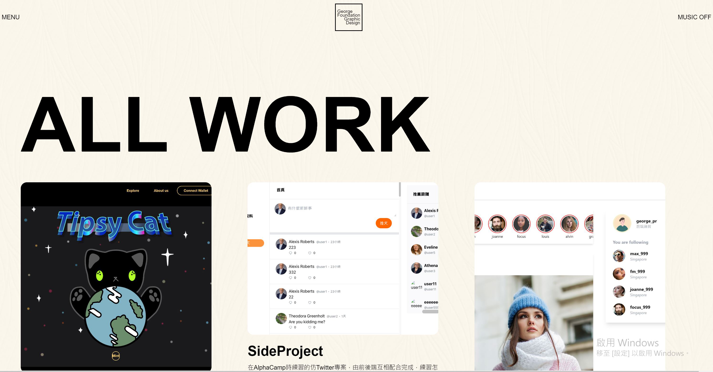

# Alphitter

Portfolio

## Getting Start

    git clone https://github.com/a88759666/Portfolio.git

    npm install

    npm run dev

## Deployment

前往 [https://a88759666.github.io/Portfolio](https://a88759666.github.io/Portfolio/)

## Intro

1. 查看作品的詳細資訊
2. 聯絡我

## 開發環境

  * React Vite
  * Typescript
  * Tailwind樣式開發

This project was bootstrapped with [Create React App](https://github.com/facebook/create-react-app).
